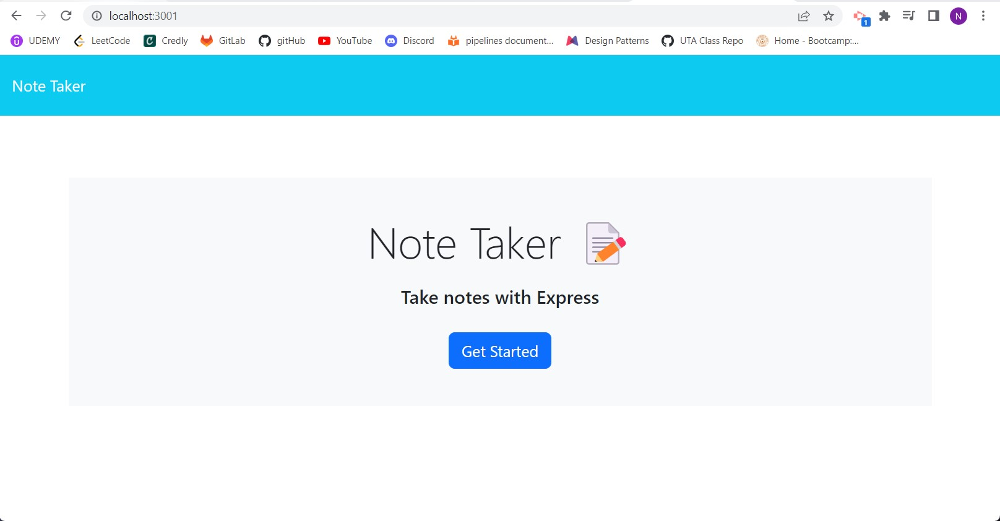
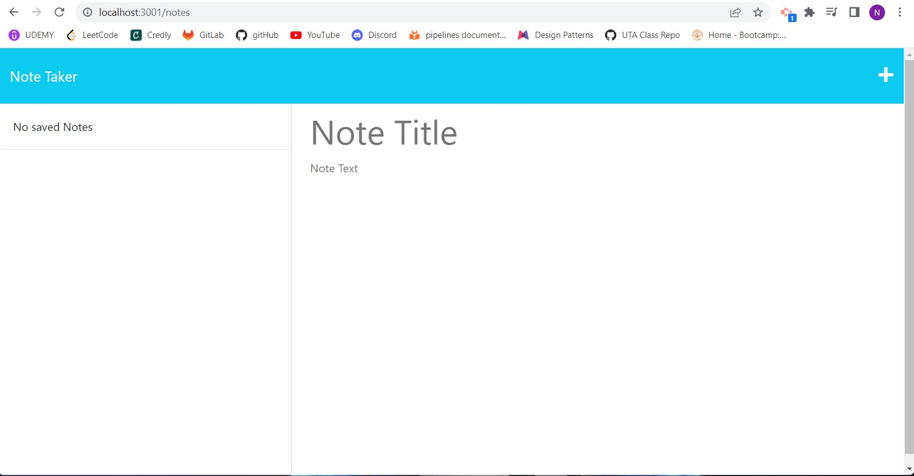
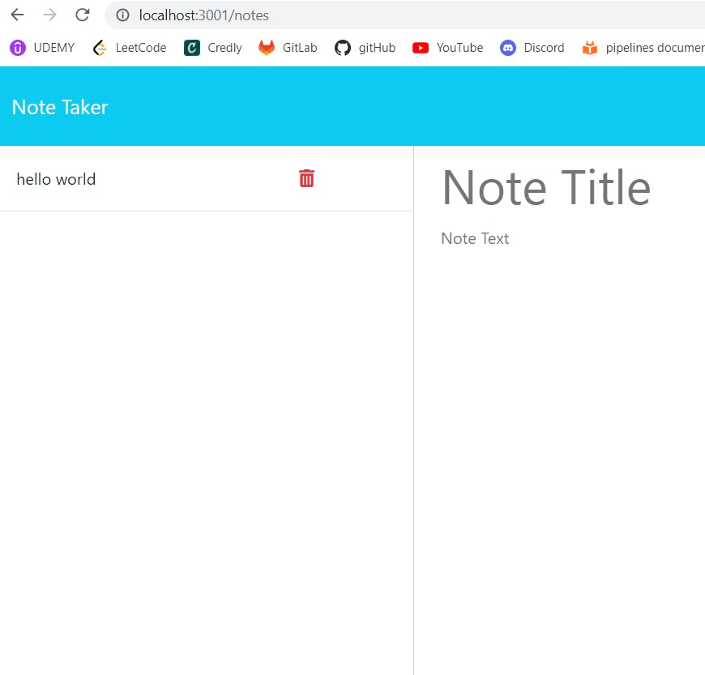

# Note Taker
 ## Description 
 Note taker demonstrating understanding of basic routing. Store and or delete notes entered by a user.
 ## Table Of Contents 
 - [Title](#title) 
 - [Description](#description) 
 - [Installation](#installation) 
 - [Usage](#usage) 
 - [License](#license) 
 - [Contributing](#contributing) 
 - [Test](#test) 
 - [Questions](#questions) 
 ## Installation 
 url:
 
 ## Usage 
 
 caption: home page working
 

 
caption: notes page working
 

 
caption: demonstrating saved note
 

 
 ## License 
 MIT License 
  
 ## Contributing 
 Michael Smith 
  
 https://github.com/AustinBQ02
  
 Rebecca Girndt
  
 https://github.com/Re-Gi
 ## Test 
 NA 
 ## Questions 
 UserName: Nick-McCarthy 
 https://github.com/Nick-McCarthy
